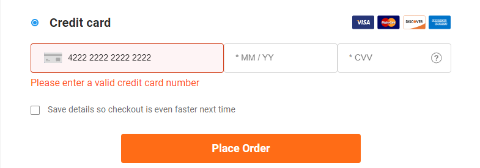

# UI task

## Analytics
Test file - `__ui__/tests/analytics/checkoutSidereview.test.ts`
Перейти со страницы солнцезащитных очков на продукт. Нажать Add To Cart. 
На странице корзины нажать Proceed to Checkout. И пройти до шага оплаты.
1) Ввести неправильный номер карты(4222 2222 2222 2222) или оставить поле пустым. 

    
    
    Поймать эвент:
    ```
    event: "CheckoutNonInteraction"
    eventAction: "Step 2 - Credit card"
    eventCategory: "Checkout - D"
    eventLabel: "Error – Please enter a valid credit card number"
    ```

2) Ввести корректный номер карты(4111 1111 1111 1111), оставив поле ММ/ГГ пустым. Поймать эвент:
    ```
    event: "CheckoutNonInteraction"
    eventAction: "Step 2 - Credit card"
    eventCategory: "Checkout - D"
    eventLabel: "Error – Please enter a valid expiration date"
    ```

3) Ввести корректные ММ/ГГ, CVV оставить пустым. Поймать эвент: 
    ```
    event: "CheckoutNonInteraction"
    eventAction: "Step 2 - Credit card"
    eventCategory: "Checkout - D"
    eventLabel: "Error – Please enter your card's security code (CVV/CID)"
    ```
   
4) Не заполняя CVV выбрать Cash on delivery. На TY Page поймать эвент: 
    ```
    "event": "CheckoutInteraction",
    "eventCategory": "Checkout - D",
    "eventAction": "Step 2 - Payment",
    "eventLabel": "CTA - Place Order - Cash On Delivery"
    ```
   

## UI
На странице обычных очков выбрать продукт, нажать Choose lenses. Пройти визард выбирая варианты без дополнительной цены.
На странице корзины проверить:
1) При увеличении количества цена меняется и отображается корректно в subtotal.
2) При уменьшении количества цена меняется и отображается корректно в subtotal.
3) При удалении корзины должна быть пустой.